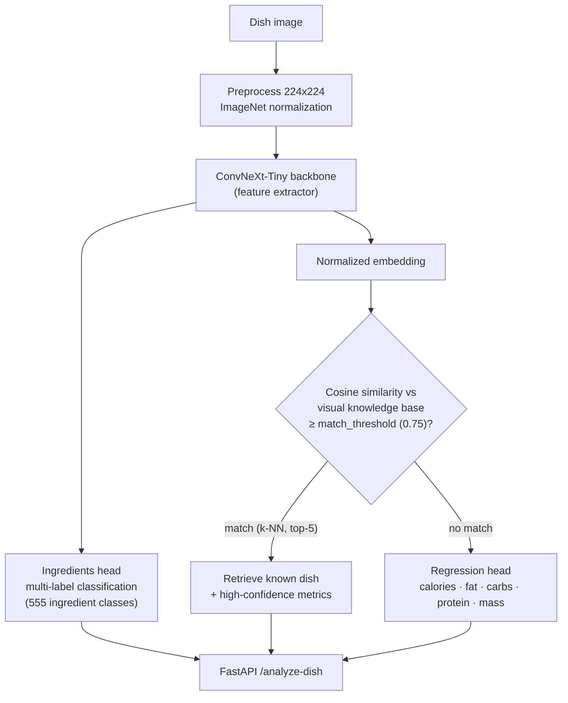

<div align="center">

# Nutrition MTL Inference Engine

### Visual macro-nutrient estimation from a single food photo

[](https://python.org)
[](https://pytorch.org)
[](https://fastapi.tiangolo.com)
[](LICENSE)

**A multi-task learning system that predicts ingredients and macro-nutrients directly from a dish image — served through a modular FastAPI backend with a hybrid embedding-matching pipeline.**

</div>

---

## Architecture



### The Hybrid Trick (`app/pipeline.py`, verified)

`run_hybrid_pipeline()` first normalizes the ConvNeXt embedding and computes **cosine similarity against a `visual_knowledge_base`** of known dishes. If the best average similarity clears `match_threshold` (0.75), it returns the matched dish's metrics with a confidence score; otherwise it falls back to the **regression head** for a direct macro-nutrient prediction. This blends retrieval accuracy with generalization to unseen dishes.

---

## Project Structure

```
Nutrition-MTL-Inference-Engine/
├── nutritionmtlmodel.ipynb     # training notebook (MTL architecture)
├── run.py                      # entry point → uvicorn server
└── app/
    ├── server.py               # FastAPI app + POST /analyze-dish
    ├── pipeline.py             # hybrid inference (k-NN match → regression fallback)
    ├── model.py                # NutritionMTLModel (ConvNeXt-Tiny + dual heads)
    ├── data.py                 # dataset utilities
    └── config.py + settings.json
```

---

## Running the Server

```bash
git clone https://github.com/YazanAi-Dev3/Nutrition-MTL-Inference-Engine.git
cd Nutrition-MTL-Inference-Engine
pip install -r requirements.txt
python run.py
```

Server starts at `http://127.0.0.1:8000` — test via Swagger UI at `/docs`.

> **Weights required:** place `best_nutrition_mtl_model.pth` and `visual_knowledge_base.pt` in the project root before running (excluded from the repo for size).

---

## Tech Stack

| Layer | Technology |
|---|---|
| Backbone | ConvNeXt-Tiny (torchvision) |
| Heads | multi-label ingredient classification + 5-target regression |
| Retrieval | cosine-similarity k-NN over a visual knowledge base |
| Serving | FastAPI + Uvicorn |

---

## License

MIT.
